# [📈 Live Status](https://status.sahli-interactive.ch): <!--live status--> **🟧 Partial outage**

This repository contains the open-source uptime monitor and status page for [sahli:interactive](https://sahli-interactive.ch), powered by [Upptime](https://github.com/upptime/upptime).

With [Upptime](https://upptime.js.org), you can get your own unlimited and free uptime monitor and status page, powered entirely by a GitHub repository. We use [Issues](https://github.com/sahli-interactive/status.sahli-interactive.ch/issues) as incident reports, [Actions](https://github.com/sahli-interactive/status.sahli-interactive.ch/actions) as uptime monitors, and [Pages](https://status.sahli-interactive.ch) for the status page.

<!--start: status pages-->
<!-- This summary is generated by Upptime (https://github.com/upptime/upptime) -->
<!-- Do not edit this manually, your changes will be overwritten -->
<!-- prettier-ignore -->
| URL | Status | History | Response Time | Uptime |
| --- | ------ | ------- | ------------- | ------ |
|  [Aare Bier Strom-Dashboard](https://aarebier.gerberenergietechnik.ch) | 🟩 Up | [aare-bier-strom-dashboard.yml](https://github.com/sahli-interactive/status.sahli-interactive.ch/commits/HEAD/history/aare-bier-strom-dashboard.yml) | 

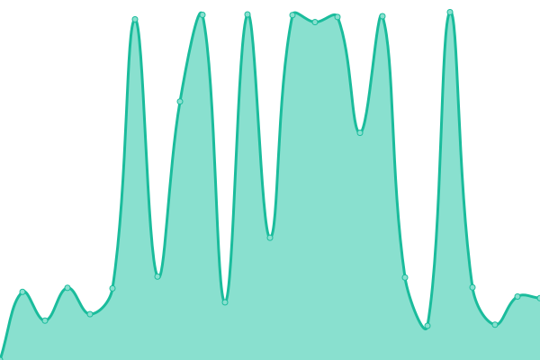 5756ms
     
 | 

<a href="https://status.sahli-interactive.ch/history/aare-bier-strom-dashboard">93.84%</a>
    

|  [ARAMIS SAR Service](https://datenausgabe.aramis.admin.ch) | 🟩 Up | [aramis-sar-service.yml](https://github.com/sahli-interactive/status.sahli-interactive.ch/commits/HEAD/history/aramis-sar-service.yml) | 

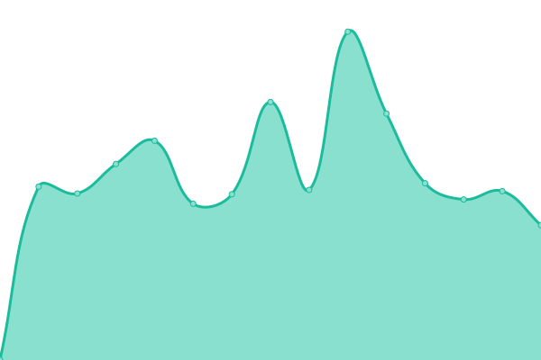 1048ms
     
 | 

<a href="https://status.sahli-interactive.ch/history/aramis-sar-service">99.90%</a>
    

|  [Autoverkehr Group](https://www.autoverkehr.ch) | 🟩 Up | [autoverkehr-group.yml](https://github.com/sahli-interactive/status.sahli-interactive.ch/commits/HEAD/history/autoverkehr-group.yml) | 

 1336ms
     
 | 

<a href="https://status.sahli-interactive.ch/history/autoverkehr-group">100.00%</a>
    

|  [Disegnato](https://www.disegnato.ch) | 🟩 Up | [disegnato.yml](https://github.com/sahli-interactive/status.sahli-interactive.ch/commits/HEAD/history/disegnato.yml) | 

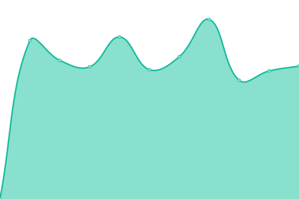 2520ms
     
 | 

<a href="https://status.sahli-interactive.ch/history/disegnato">100.00%</a>
    

|  [Cardinal Coolbox Promotion](https://win.cardinal.ch) | 🟩 Up | [cardinal-coolbox-promotion.yml](https://github.com/sahli-interactive/status.sahli-interactive.ch/commits/HEAD/history/cardinal-coolbox-promotion.yml) | 

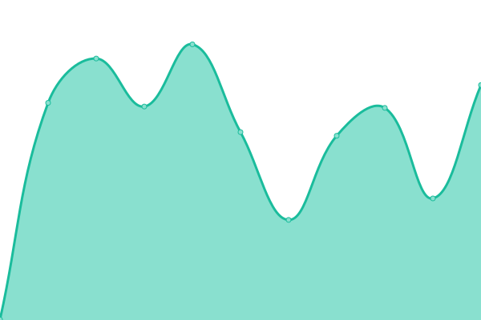 422ms
     
 | 

<a href="https://status.sahli-interactive.ch/history/cardinal-coolbox-promotion">100.00%</a>
    

|  [Cerletti Immobilien](https://www.cerlettimmobilien.ch) | 🟩 Up | [cerletti-immobilien.yml](https://github.com/sahli-interactive/status.sahli-interactive.ch/commits/HEAD/history/cerletti-immobilien.yml) | 

 411ms
     
 | 

<a href="https://status.sahli-interactive.ch/history/cerletti-immobilien">100.00%</a>
    

|  [Christen Gartenbau AG](https://www.christen-gartenbau.ch) | 🟩 Up | [christen-gartenbau-ag.yml](https://github.com/sahli-interactive/status.sahli-interactive.ch/commits/HEAD/history/christen-gartenbau-ag.yml) | 

 548ms
     
 | 

<a href="https://status.sahli-interactive.ch/history/christen-gartenbau-ag">100.00%</a>
    

|  [Creativ Personal AG](https://www.creativpersonal.ch) | 🟩 Up | [creativ-personal-ag.yml](https://github.com/sahli-interactive/status.sahli-interactive.ch/commits/HEAD/history/creativ-personal-ag.yml) | 

 1197ms
     
 | 

<a href="https://status.sahli-interactive.ch/history/creativ-personal-ag">100.00%</a>
    

|  [Etage Est GmbH](https://www.etage-est.ch) | 🟩 Up | [etage-est-gmb-h.yml](https://github.com/sahli-interactive/status.sahli-interactive.ch/commits/HEAD/history/etage-est-gmb-h.yml) | 

 1231ms
     
 | 

<a href="https://status.sahli-interactive.ch/history/etage-est-gmb-h">100.00%</a>
    

|  [F.G. Pfister](https://www.fgpfister.ch) | 🟩 Up | [f-g-pfister.yml](https://github.com/sahli-interactive/status.sahli-interactive.ch/commits/HEAD/history/f-g-pfister.yml) | 

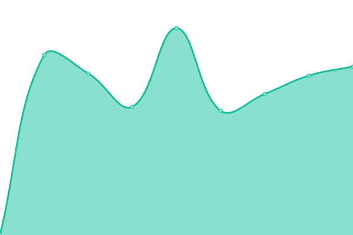 782ms
     
 | 

<a href="https://status.sahli-interactive.ch/history/f-g-pfister">100.00%</a>
    

|  [FAIRMED Schweiz](https://www.fairmed.ch) | 🟩 Up | [fairmed-schweiz.yml](https://github.com/sahli-interactive/status.sahli-interactive.ch/commits/HEAD/history/fairmed-schweiz.yml) | 

 298ms
     
 | 

<a href="https://status.sahli-interactive.ch/history/fairmed-schweiz">100.00%</a>
    

|  [FAIRMED Kamerun](https://fairmed.cm) | 🟩 Up | [fairmed-kamerun.yml](https://github.com/sahli-interactive/status.sahli-interactive.ch/commits/HEAD/history/fairmed-kamerun.yml) | 

 1474ms
     
 | 

<a href="https://status.sahli-interactive.ch/history/fairmed-kamerun">100.00%</a>
    

|  [FAIRMED Nepal](https://www.fairmed.org.np) | 🟩 Up | [fairmed-nepal.yml](https://github.com/sahli-interactive/status.sahli-interactive.ch/commits/HEAD/history/fairmed-nepal.yml) | 

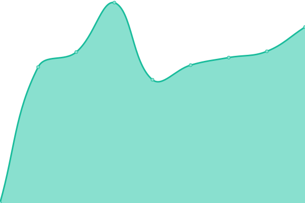 1835ms
     
 | 

<a href="https://status.sahli-interactive.ch/history/fairmed-nepal">100.00%</a>
    

|  [FAIRMED Sri Lanka](https://fairmedsrilanka.org) | 🟩 Up | [fairmed-sri-lanka.yml](https://github.com/sahli-interactive/status.sahli-interactive.ch/commits/HEAD/history/fairmed-sri-lanka.yml) | 

 2470ms
     
 | 

<a href="https://status.sahli-interactive.ch/history/fairmed-sri-lanka">100.00%</a>
    

|  [Farbwerk Herren](https://www.farbwerkag.ch) | 🟩 Up | [farbwerk-herren.yml](https://github.com/sahli-interactive/status.sahli-interactive.ch/commits/HEAD/history/farbwerk-herren.yml) | 

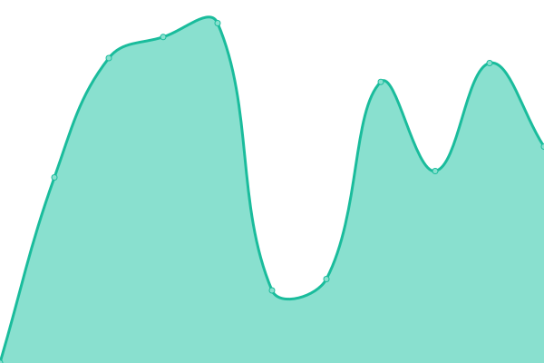 982ms
     
 | 

<a href="https://status.sahli-interactive.ch/history/farbwerk-herren">100.00%</a>
    

|  [Farbwerk Herren Online-Shop](https://shop.farbwerkag.ch) | 🟩 Up | [farbwerk-herren-online-shop.yml](https://github.com/sahli-interactive/status.sahli-interactive.ch/commits/HEAD/history/farbwerk-herren-online-shop.yml) | 

 1220ms
     
 | 

<a href="https://status.sahli-interactive.ch/history/farbwerk-herren-online-shop">43.73%</a>
    

|  [FTEM Karate](https://www.ftem-karate.ch) | 🟩 Up | [ftem-karate.yml](https://github.com/sahli-interactive/status.sahli-interactive.ch/commits/HEAD/history/ftem-karate.yml) | 

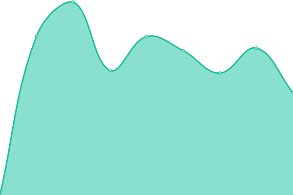 1364ms
     
 | 

<a href="https://status.sahli-interactive.ch/history/ftem-karate">100.00%</a>
    

|  [Germann Treuhand](https://www.germann-treuhand.ch) | 🟩 Up | [germann-treuhand.yml](https://github.com/sahli-interactive/status.sahli-interactive.ch/commits/HEAD/history/germann-treuhand.yml) | 

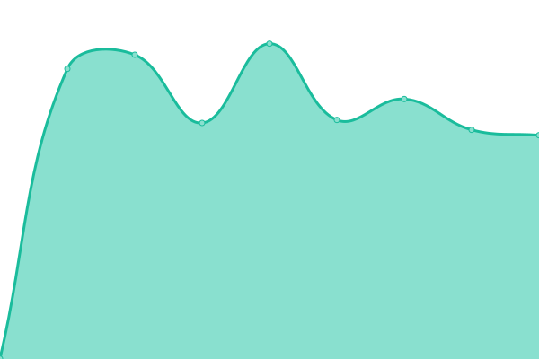 925ms
     
 | 

<a href="https://status.sahli-interactive.ch/history/germann-treuhand">100.00%</a>
    

|  [Glas-Werkstatt Kräuchi](https://www.kraeuchi.ch) | 🟩 Up | [glas-werkstatt-kraeuchi.yml](https://github.com/sahli-interactive/status.sahli-interactive.ch/commits/HEAD/history/glas-werkstatt-kraeuchi.yml) | 

 553ms
     
 | 

<a href="https://status.sahli-interactive.ch/history/glas-werkstatt-kraeuchi">100.00%</a>
    

|  [Goju Kan Bern AG](https://www.gojukan.ch) | 🟩 Up | [goju-kan-bern-ag.yml](https://github.com/sahli-interactive/status.sahli-interactive.ch/commits/HEAD/history/goju-kan-bern-ag.yml) | 

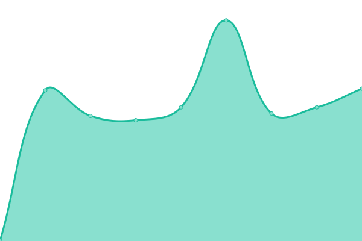 544ms
     
 | 

<a href="https://status.sahli-interactive.ch/history/goju-kan-bern-ag">100.00%</a>
    

|  [Haus des Sports](https://www.hausdessports.ch) | 🟩 Up | [haus-des-sports.yml](https://github.com/sahli-interactive/status.sahli-interactive.ch/commits/HEAD/history/haus-des-sports.yml) | 

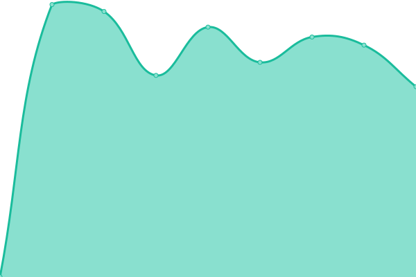 1237ms
     
 | 

<a href="https://status.sahli-interactive.ch/history/haus-des-sports">100.00%</a>
    

|  [Heidadorf Visperterminen](https://www.heidadorf.ch) | 🟩 Up | [heidadorf-visperterminen.yml](https://github.com/sahli-interactive/status.sahli-interactive.ch/commits/HEAD/history/heidadorf-visperterminen.yml) | 

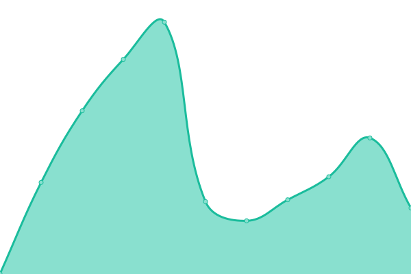 516ms
     
 | 

<a href="https://status.sahli-interactive.ch/history/heidadorf-visperterminen">100.00%</a>
    

|  [Hilscher Swiss](https://www.hilscher.ch) | 🟩 Up | [hilscher-swiss.yml](https://github.com/sahli-interactive/status.sahli-interactive.ch/commits/HEAD/history/hilscher-swiss.yml) | 

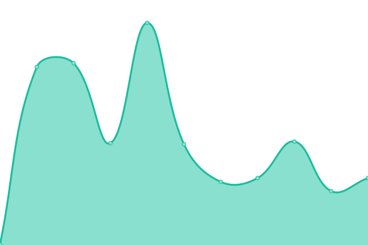 241ms
     
 | 

<a href="https://status.sahli-interactive.ch/history/hilscher-swiss">100.00%</a>
    

|  [Hofmatt Uettligen](https://www.hofmattuettligen.ch) | 🟩 Up | [hofmatt-uettligen.yml](https://github.com/sahli-interactive/status.sahli-interactive.ch/commits/HEAD/history/hofmatt-uettligen.yml) | 

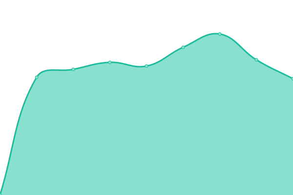 1734ms
     
 | 

<a href="https://status.sahli-interactive.ch/history/hofmatt-uettligen">100.00%</a>
    

|  [Huldi + Stucki AG](https://www.huldi-stucki.ch) | 🟩 Up | [huldi-stucki-ag.yml](https://github.com/sahli-interactive/status.sahli-interactive.ch/commits/HEAD/history/huldi-stucki-ag.yml) | 

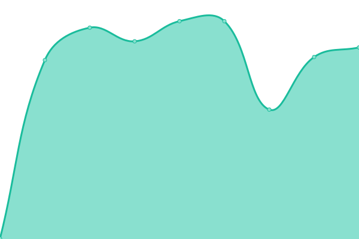 550ms
     
 | 

<a href="https://status.sahli-interactive.ch/history/huldi-stucki-ag">100.00%</a>
    

|  [Initiative Schweiz](https://www.initiative-schweiz.org) | 🟩 Up | [initiative-schweiz.yml](https://github.com/sahli-interactive/status.sahli-interactive.ch/commits/HEAD/history/initiative-schweiz.yml) | 

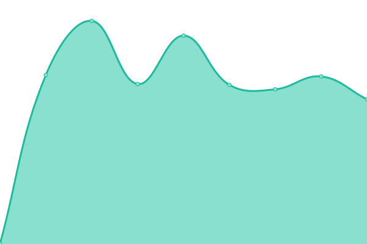 1304ms
     
 | 

<a href="https://status.sahli-interactive.ch/history/initiative-schweiz">100.00%</a>
    

|  [Insecor](https://www.insecor.ch) | 🟩 Up | [insecor.yml](https://github.com/sahli-interactive/status.sahli-interactive.ch/commits/HEAD/history/insecor.yml) | 

 1056ms
     
 | 

<a href="https://status.sahli-interactive.ch/history/insecor">93.21%</a>
    

|  [Koor Baumanagement](https://www.koor-baumanagement.ch) | 🟩 Up | [koor-baumanagement.yml](https://github.com/sahli-interactive/status.sahli-interactive.ch/commits/HEAD/history/koor-baumanagement.yml) | 

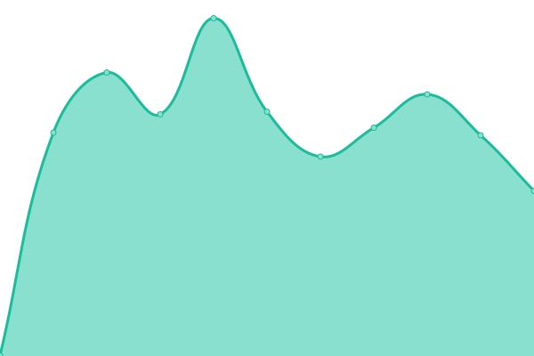 543ms
     
 | 

<a href="https://status.sahli-interactive.ch/history/koor-baumanagement">100.00%</a>
    

|  [M & T Schreinerei GmbH](https://www.mt-schreinerei.ch) | 🟩 Up | [m-and-t-schreinerei-gmb-h.yml](https://github.com/sahli-interactive/status.sahli-interactive.ch/commits/HEAD/history/m-and-t-schreinerei-gmb-h.yml) | 

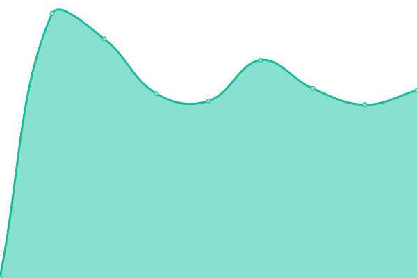 445ms
     
 | 

<a href="https://status.sahli-interactive.ch/history/m-and-t-schreinerei-gmb-h">100.00%</a>
    

|  [Malerei Zimmermann](https://www.zimal.ch) | 🟩 Up | [malerei-zimmermann.yml](https://github.com/sahli-interactive/status.sahli-interactive.ch/commits/HEAD/history/malerei-zimmermann.yml) | 

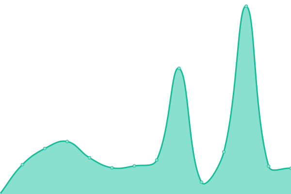 1377ms
     
 | 

<a href="https://status.sahli-interactive.ch/history/malerei-zimmermann">98.45%</a>
    

|  [Masina. Gfeller. Nyffenegger](https://mgnrecht.ch) | 🟩 Up | [masina-gfeller-nyffenegger.yml](https://github.com/sahli-interactive/status.sahli-interactive.ch/commits/HEAD/history/masina-gfeller-nyffenegger.yml) | 

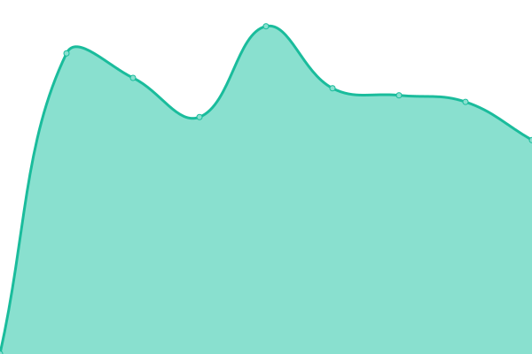 1108ms
     
 | 

<a href="https://status.sahli-interactive.ch/history/masina-gfeller-nyffenegger">100.00%</a>
    

|  [MLS Architekten](https://www.mls-architekten.ch) | 🟩 Up | [mls-architekten.yml](https://github.com/sahli-interactive/status.sahli-interactive.ch/commits/HEAD/history/mls-architekten.yml) | 

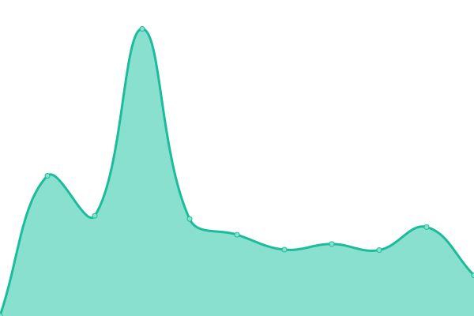 446ms
     
 | 

<a href="https://status.sahli-interactive.ch/history/mls-architekten">100.00%</a>
    

|  [Notariat Haas](https://www.notariat-haas.ch) | 🟩 Up | [notariat-haas.yml](https://github.com/sahli-interactive/status.sahli-interactive.ch/commits/HEAD/history/notariat-haas.yml) | 

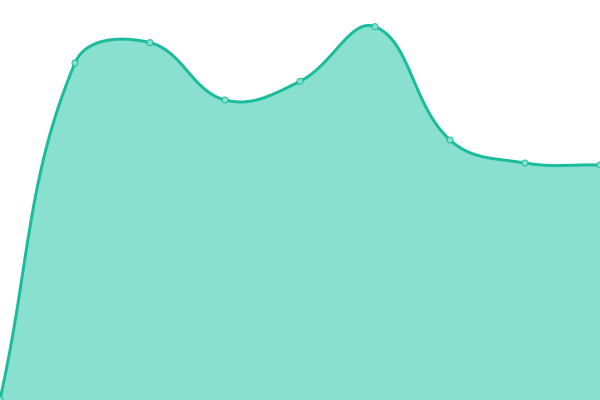 937ms
     
 | 

<a href="https://status.sahli-interactive.ch/history/notariat-haas">100.00%</a>
    

|  [Nuwa](https://www.nuwa.swiss) | 🟩 Up | [nuwa.yml](https://github.com/sahli-interactive/status.sahli-interactive.ch/commits/HEAD/history/nuwa.yml) | 

 590ms
     
 | 

<a href="https://status.sahli-interactive.ch/history/nuwa">100.00%</a>
    

|  [Philosophie.ch](https://www.philosophie.ch) | 🟥 Down | [philosophie-ch.yml](https://github.com/sahli-interactive/status.sahli-interactive.ch/commits/HEAD/history/philosophie-ch.yml) | 

 180ms
     
 | 

<a href="https://status.sahli-interactive.ch/history/philosophie-ch">0.00%</a>
    

|  [René Otter Architekten GmbH](https://reneotter.ch) | 🟩 Up | [rene-otter-architekten-gmb-h.yml](https://github.com/sahli-interactive/status.sahli-interactive.ch/commits/HEAD/history/rene-otter-architekten-gmb-h.yml) | 

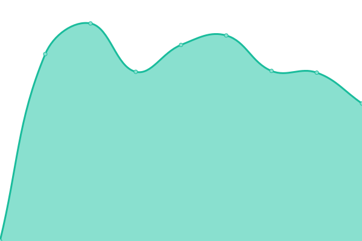 1152ms
     
 | 

<a href="https://status.sahli-interactive.ch/history/rene-otter-architekten-gmb-h">100.00%</a>
    

|  [Rudolf Obrecht AG](https://www.rudolfobrecht.com) | 🟩 Up | [rudolf-obrecht-ag.yml](https://github.com/sahli-interactive/status.sahli-interactive.ch/commits/HEAD/history/rudolf-obrecht-ag.yml) | 

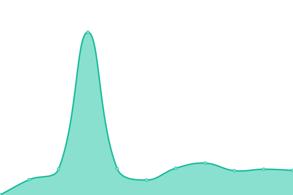 1117ms
     
 | 

<a href="https://status.sahli-interactive.ch/history/rudolf-obrecht-ag">100.00%</a>
    

|  [Rüfenacht Elektro AG](https://www.ruefenacht-elektro.ch) | 🟩 Up | [ruefenacht-elektro-ag.yml](https://github.com/sahli-interactive/status.sahli-interactive.ch/commits/HEAD/history/ruefenacht-elektro-ag.yml) | 

 311ms
     
 | 

<a href="https://status.sahli-interactive.ch/history/ruefenacht-elektro-ag">100.00%</a>
    

|  [sahli:interactive](https://sahli-interactive.ch) | 🟩 Up | [sahli-interactive.yml](https://github.com/sahli-interactive/status.sahli-interactive.ch/commits/HEAD/history/sahli-interactive.yml) | 

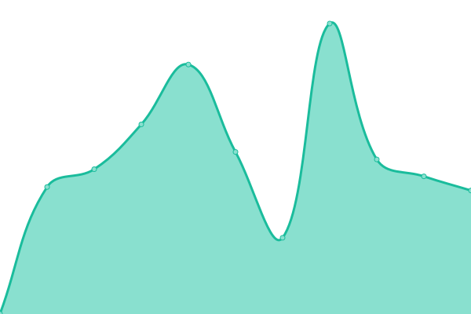 965ms
     
 | 

<a href="https://status.sahli-interactive.ch/history/sahli-interactive">100.00%</a>
    

|  [SahliBeschriftung](https://www.sahlibeschriftung.ch) | 🟩 Up | [sahli-beschriftung.yml](https://github.com/sahli-interactive/status.sahli-interactive.ch/commits/HEAD/history/sahli-beschriftung.yml) | 

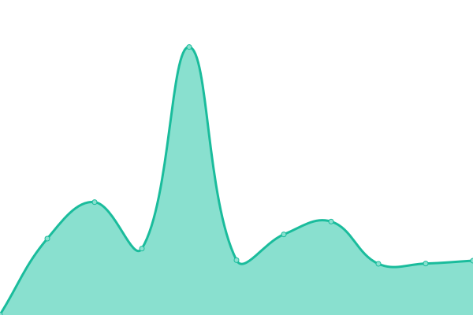 332ms
     
 | 

<a href="https://status.sahli-interactive.ch/history/sahli-beschriftung">100.00%</a>
    

|  [sahli.app](https://sahli.app) | 🟩 Up | [sahli-app.yml](https://github.com/sahli-interactive/status.sahli-interactive.ch/commits/HEAD/history/sahli-app.yml) | 

 1114ms
     
 | 

<a href="https://status.sahli-interactive.ch/history/sahli-app">100.00%</a>
    

|  [Salzmann Uhren & Bijouterie](https://www.zeitfuersalzmann.ch) | 🟩 Up | [salzmann-uhren-and-bijouterie.yml](https://github.com/sahli-interactive/status.sahli-interactive.ch/commits/HEAD/history/salzmann-uhren-and-bijouterie.yml) | 

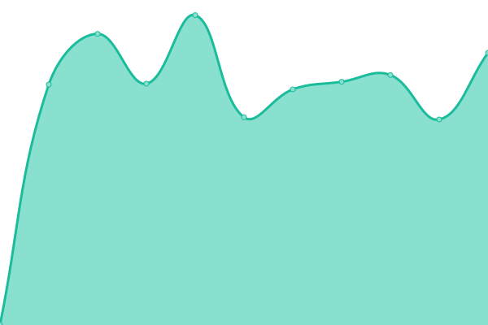 882ms
     
 | 

<a href="https://status.sahli-interactive.ch/history/salzmann-uhren-and-bijouterie">100.00%</a>
    

|  [Schnyder Werbung](https://schnyder-werbung.ch) | 🟩 Up | [schnyder-werbung.yml](https://github.com/sahli-interactive/status.sahli-interactive.ch/commits/HEAD/history/schnyder-werbung.yml) | 

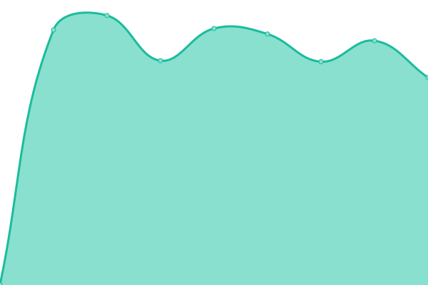 1190ms
     
 | 

<a href="https://status.sahli-interactive.ch/history/schnyder-werbung">100.00%</a>
    

|  [Siloah Energie-Dashboard](https://zevsiloahsued.gerberenergietechnik.ch) | 🟩 Up | [siloah-energie-dashboard.yml](https://github.com/sahli-interactive/status.sahli-interactive.ch/commits/HEAD/history/siloah-energie-dashboard.yml) | 

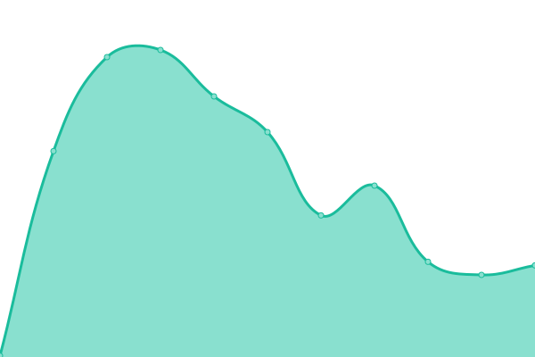 167ms
     
 | 

<a href="https://status.sahli-interactive.ch/history/siloah-energie-dashboard">100.00%</a>
    

|  [Sorglos Design](https://www.sorglos-design.ch/) | 🟩 Up | [sorglos-design.yml](https://github.com/sahli-interactive/status.sahli-interactive.ch/commits/HEAD/history/sorglos-design.yml) | 

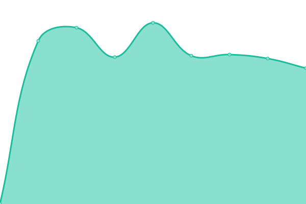 1256ms
     
 | 

<a href="https://status.sahli-interactive.ch/history/sorglos-design">100.00%</a>
    

|  [Sport Amstutz](https://www.sport-amstutz.ch) | 🟩 Up | [sport-amstutz.yml](https://github.com/sahli-interactive/status.sahli-interactive.ch/commits/HEAD/history/sport-amstutz.yml) | 

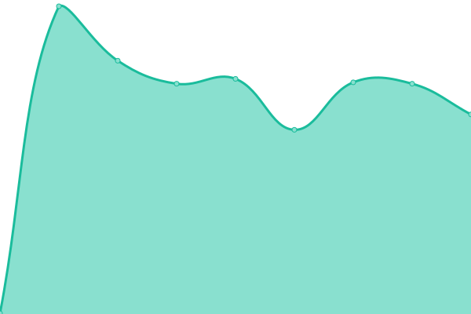 338ms
     
 | 

<a href="https://status.sahli-interactive.ch/history/sport-amstutz">100.00%</a>
    

|  [TECTON](https://www.tecton.ch) | 🟩 Up | [tecton.yml](https://github.com/sahli-interactive/status.sahli-interactive.ch/commits/HEAD/history/tecton.yml) | 

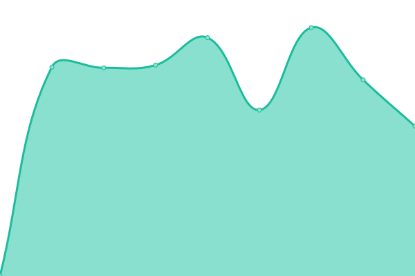 1058ms
     
 | 

<a href="https://status.sahli-interactive.ch/history/tecton">100.00%</a>
    

|  [tubus GmbH](https://tubusgmbh.ch) | 🟩 Up | [tubus-gmb-h.yml](https://github.com/sahli-interactive/status.sahli-interactive.ch/commits/HEAD/history/tubus-gmb-h.yml) | 

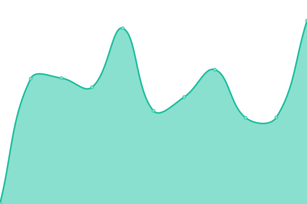 386ms
     
 | 

<a href="https://status.sahli-interactive.ch/history/tubus-gmb-h">100.00%</a>
    

|  [Traumbaum](https://traumbaum.ch) | 🟩 Up | [traumbaum.yml](https://github.com/sahli-interactive/status.sahli-interactive.ch/commits/HEAD/history/traumbaum.yml) | 

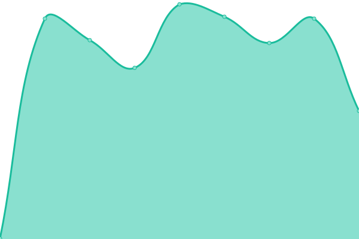 404ms
     
 | 

<a href="https://status.sahli-interactive.ch/history/traumbaum">100.00%</a>
    

|  [urSIGN](https://www.ursign.ch) | 🟩 Up | [ur-sign.yml](https://github.com/sahli-interactive/status.sahli-interactive.ch/commits/HEAD/history/ur-sign.yml) | 

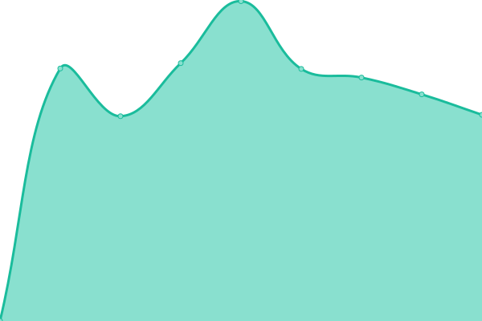 2373ms
     
 | 

<a href="https://status.sahli-interactive.ch/history/ur-sign">100.00%</a>
    

|  [Ziegelhüsi](https://www.ziegelhuesi.ch) | 🟩 Up | [ziegelhuesi.yml](https://github.com/sahli-interactive/status.sahli-interactive.ch/commits/HEAD/history/ziegelhuesi.yml) | 

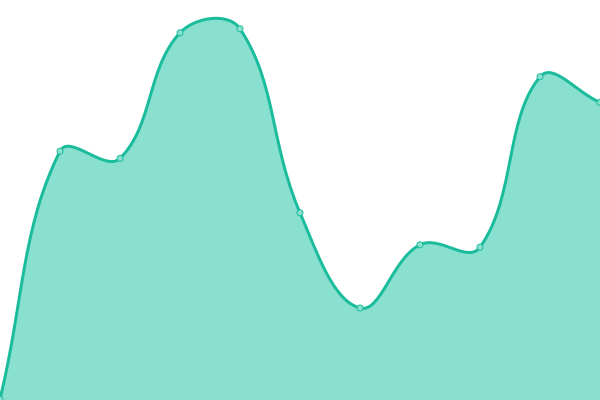 262ms
     
 | 

<a href="https://status.sahli-interactive.ch/history/ziegelhuesi">100.00%</a>
    

|  [Zwahlen & Wieser Energie-Dashboard](https://zwahlen-wieser.gerberenergietechnik.ch) | 🟩 Up | [zwahlen-and-wieser-energie-dashboard.yml](https://github.com/sahli-interactive/status.sahli-interactive.ch/commits/HEAD/history/zwahlen-and-wieser-energie-dashboard.yml) | 

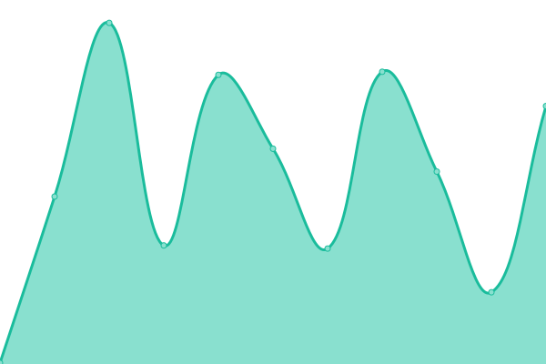 196ms
     
 | 

<a href="https://status.sahli-interactive.ch/history/zwahlen-and-wieser-energie-dashboard">100.00%</a>
    

<!--end: status pages-->

[**Visit our status website →**](https://status.sahli-interactive.ch)

## 📄 License

- Powered by: [Upptime](https://github.com/upptime/upptime)
- Code: [MIT](./LICENSE) © [sahli:interactive](https://sahli-interactive.ch)
- Data in the `./history` directory: [Open Database License](https://opendatacommons.org/licenses/odbl/1-0/)
