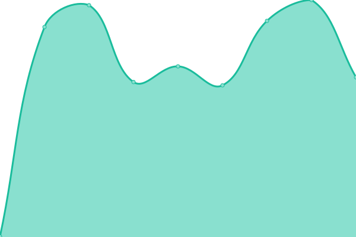
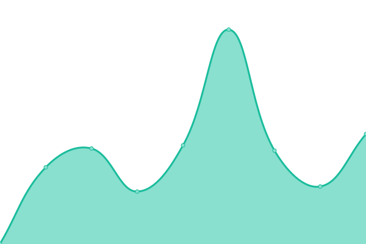
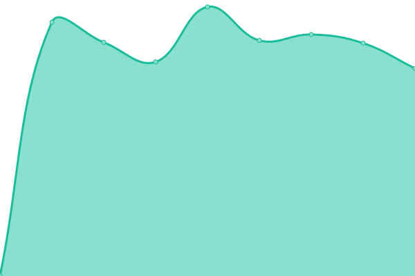
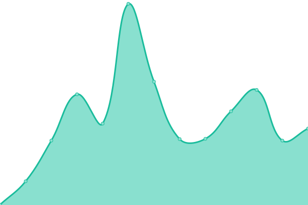
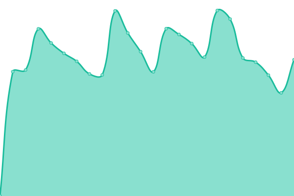
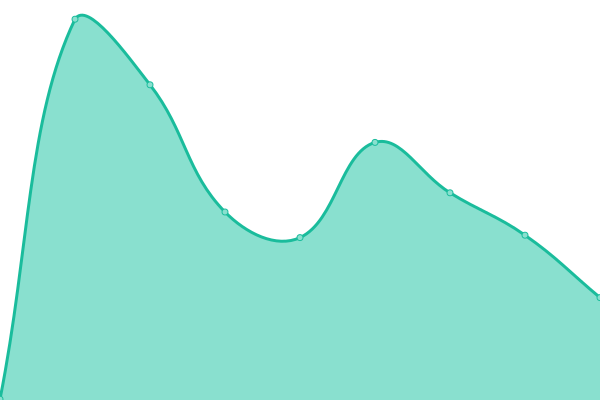
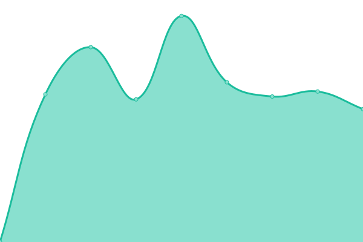

# [📈 Live Status](https://status.sahli-interactive.ch): <!--live status--> **🟧 Partial outage**

This repository contains the open-source uptime monitor and status page for [sahli:interactive](https://sahli-interactive.ch), powered by [Upptime](https://github.com/upptime/upptime).

With [Upptime](https://upptime.js.org), you can get your own unlimited and free uptime monitor and status page, powered entirely by a GitHub repository. We use [Issues](https://github.com/sahli-interactive/status.sahli-interactive.ch/issues) as incident reports, [Actions](https://github.com/sahli-interactive/status.sahli-interactive.ch/actions) as uptime monitors, and [Pages](https://status.sahli-interactive.ch) for the status page.

<!--start: status pages-->
<!-- This summary is generated by Upptime (https://github.com/upptime/upptime) -->
<!-- Do not edit this manually, your changes will be overwritten -->
<!-- prettier-ignore -->
| URL | Status | History | Response Time | Uptime |
| --- | ------ | ------- | ------------- | ------ |
|  [Apart Hotel Adelboden](https://www.aparthotel-adelboden.ch) | 🟩 Up | [apart-hotel-adelboden.yml](https://github.com/sahli-interactive/status.sahli-interactive.ch/commits/HEAD/history/apart-hotel-adelboden.yml) | 

 793ms
     
 | 

<a href="https://status.sahli-interactive.ch/history/apart-hotel-adelboden">100.00%</a>
    

|  [Cardinal Coolbox Promotion](https://win.cardinal.ch) | 🟩 Up | [cardinal-coolbox-promotion.yml](https://github.com/sahli-interactive/status.sahli-interactive.ch/commits/HEAD/history/cardinal-coolbox-promotion.yml) | 

 209ms
     
 | 

<a href="https://status.sahli-interactive.ch/history/cardinal-coolbox-promotion">100.00%</a>
    

|  [Cerletti Immobilien](https://www.cerlettimmobilien.ch) | 🟩 Up | [cerletti-immobilien.yml](https://github.com/sahli-interactive/status.sahli-interactive.ch/commits/HEAD/history/cerletti-immobilien.yml) | 

 249ms
     
 | 

<a href="https://status.sahli-interactive.ch/history/cerletti-immobilien">100.00%</a>
    

|  [Christen Gartenbau AG](https://www.christen-gartenbau.ch) | 🟩 Up | [christen-gartenbau-ag.yml](https://github.com/sahli-interactive/status.sahli-interactive.ch/commits/HEAD/history/christen-gartenbau-ag.yml) | 

 470ms
     
 | 

<a href="https://status.sahli-interactive.ch/history/christen-gartenbau-ag">100.00%</a>
    

|  [Creativ Personal AG](https://www.creativpersonal.ch) | 🟩 Up | [creativ-personal-ag.yml](https://github.com/sahli-interactive/status.sahli-interactive.ch/commits/HEAD/history/creativ-personal-ag.yml) | 

 780ms
     
 | 

<a href="https://status.sahli-interactive.ch/history/creativ-personal-ag">100.00%</a>
    

|  [Etage Est GmbH](https://www.etage-est.ch) | 🟩 Up | [etage-est-gmb-h.yml](https://github.com/sahli-interactive/status.sahli-interactive.ch/commits/HEAD/history/etage-est-gmb-h.yml) | 

 1038ms
     
 | 

<a href="https://status.sahli-interactive.ch/history/etage-est-gmb-h">100.00%</a>
    

|  [FAIRMED Kamerun](https://fairmed.cm) | 🟩 Up | [fairmed-kamerun.yml](https://github.com/sahli-interactive/status.sahli-interactive.ch/commits/HEAD/history/fairmed-kamerun.yml) | 

 1088ms
     
 | 

<a href="https://status.sahli-interactive.ch/history/fairmed-kamerun">100.00%</a>
    

|  [FAIRMED Nepal](https://www.fairmed.org.np) | 🟩 Up | [fairmed-nepal.yml](https://github.com/sahli-interactive/status.sahli-interactive.ch/commits/HEAD/history/fairmed-nepal.yml) | 

 1522ms
     
 | 

<a href="https://status.sahli-interactive.ch/history/fairmed-nepal">100.00%</a>
    

|  [FAIRMED Schweiz](https://www.fairmed.ch) | 🟩 Up | [fairmed-schweiz.yml](https://github.com/sahli-interactive/status.sahli-interactive.ch/commits/HEAD/history/fairmed-schweiz.yml) | 

 295ms
     
 | 

<a href="https://status.sahli-interactive.ch/history/fairmed-schweiz">100.00%</a>
    

|  [FAIRMED Sri Lanka](http://fairmedsrilanka.org) | 🟥 Down | [fairmed-sri-lanka.yml](https://github.com/sahli-interactive/status.sahli-interactive.ch/commits/HEAD/history/fairmed-sri-lanka.yml) | 

 0ms
     
 | 

<a href="https://status.sahli-interactive.ch/history/fairmed-sri-lanka">0.00%</a>
    

|  [Forum Sumiswald](https://www.forum-sumiswald.ch) | 🟩 Up | [forum-sumiswald.yml](https://github.com/sahli-interactive/status.sahli-interactive.ch/commits/HEAD/history/forum-sumiswald.yml) | 

 997ms
     
 | 

<a href="https://status.sahli-interactive.ch/history/forum-sumiswald">100.00%</a>
    

|  [Glas-Werkstatt Kräuchi](https://www.kraeuchi.ch) | 🟩 Up | [glas-werkstatt-kraeuchi.yml](https://github.com/sahli-interactive/status.sahli-interactive.ch/commits/HEAD/history/glas-werkstatt-kraeuchi.yml) | 

 439ms
     
 | 

<a href="https://status.sahli-interactive.ch/history/glas-werkstatt-kraeuchi">100.00%</a>
    

|  [Goju Kan Bern AG](https://www.gojukan.ch) | 🟩 Up | [goju-kan-bern-ag.yml](https://github.com/sahli-interactive/status.sahli-interactive.ch/commits/HEAD/history/goju-kan-bern-ag.yml) | 

 322ms
     
 | 

<a href="https://status.sahli-interactive.ch/history/goju-kan-bern-ag">100.00%</a>
    

|  [Hirter Bedachungen AG](https://www.hirter.ch) | 🟩 Up | [hirter-bedachungen-ag.yml](https://github.com/sahli-interactive/status.sahli-interactive.ch/commits/HEAD/history/hirter-bedachungen-ag.yml) | 

 303ms
     
 | 

<a href="https://status.sahli-interactive.ch/history/hirter-bedachungen-ag">100.00%</a>
    

|  [Huldi + Stucki AG](https://www.huldi-stucki.ch) | 🟩 Up | [huldi-stucki-ag.yml](https://github.com/sahli-interactive/status.sahli-interactive.ch/commits/HEAD/history/huldi-stucki-ag.yml) | 

 687ms
     
 | 

<a href="https://status.sahli-interactive.ch/history/huldi-stucki-ag">100.00%</a>
    

|  [Insecor](https://www.insecor.ch) | 🟩 Up | [insecor.yml](https://github.com/sahli-interactive/status.sahli-interactive.ch/commits/HEAD/history/insecor.yml) | 

 814ms
     
 | 

<a href="https://status.sahli-interactive.ch/history/insecor">100.00%</a>
    

|  [M & T Schreinerei GmbH](https://www.mt-schreinerei.ch) | 🟩 Up | [m-and-t-schreinerei-gmb-h.yml](https://github.com/sahli-interactive/status.sahli-interactive.ch/commits/HEAD/history/m-and-t-schreinerei-gmb-h.yml) | 

 299ms
     
 | 

<a href="https://status.sahli-interactive.ch/history/m-and-t-schreinerei-gmb-h">100.00%</a>
    

|  [Malerei Zimmermann](https://www.zimal.ch) | 🟩 Up | [malerei-zimmermann.yml](https://github.com/sahli-interactive/status.sahli-interactive.ch/commits/HEAD/history/malerei-zimmermann.yml) | 

 591ms
     
 | 

<a href="https://status.sahli-interactive.ch/history/malerei-zimmermann">100.00%</a>
    

|  [Masina. Gfeller. Nyffenegger](https://mgnrecht.ch) | 🟩 Up | [masina-gfeller-nyffenegger.yml](https://github.com/sahli-interactive/status.sahli-interactive.ch/commits/HEAD/history/masina-gfeller-nyffenegger.yml) | 

 904ms
     
 | 

<a href="https://status.sahli-interactive.ch/history/masina-gfeller-nyffenegger">100.00%</a>
    

|  [Notariat Haas](https://www.notariat-haas.ch) | 🟩 Up | [notariat-haas.yml](https://github.com/sahli-interactive/status.sahli-interactive.ch/commits/HEAD/history/notariat-haas.yml) | 

 729ms
     
 | 

<a href="https://status.sahli-interactive.ch/history/notariat-haas">100.00%</a>
    

|  [Philosophie.ch](https://www.philosophie.ch) | 🟩 Up | [philosophie-ch.yml](https://github.com/sahli-interactive/status.sahli-interactive.ch/commits/HEAD/history/philosophie-ch.yml) | 

 2080ms
     
 | 

<a href="https://status.sahli-interactive.ch/history/philosophie-ch">99.69%</a>
    

|  [Rüfenacht Elektro AG](https://www.ruefenacht-elektro.ch) | 🟩 Up | [ruefenacht-elektro-ag.yml](https://github.com/sahli-interactive/status.sahli-interactive.ch/commits/HEAD/history/ruefenacht-elektro-ag.yml) | 

 138ms
     
 | 

<a href="https://status.sahli-interactive.ch/history/ruefenacht-elektro-ag">100.00%</a>
    

|  [sahli:interactive](https://sahli-interactive.ch) | 🟩 Up | [sahli-interactive.yml](https://github.com/sahli-interactive/status.sahli-interactive.ch/commits/HEAD/history/sahli-interactive.yml) | 

 777ms
     
 | 

<a href="https://status.sahli-interactive.ch/history/sahli-interactive">100.00%</a>
    

|  [SahliBeschriftung](https://www.sahlibeschriftung.ch) | 🟩 Up | [sahli-beschriftung.yml](https://github.com/sahli-interactive/status.sahli-interactive.ch/commits/HEAD/history/sahli-beschriftung.yml) | 

 785ms
     
 | 

<a href="https://status.sahli-interactive.ch/history/sahli-beschriftung">100.00%</a>
    

|  [sahli.app](https://sahli.app) | 🟩 Up | [sahli-app.yml](https://github.com/sahli-interactive/status.sahli-interactive.ch/commits/HEAD/history/sahli-app.yml) | 

 992ms
     
 | 

<a href="https://status.sahli-interactive.ch/history/sahli-app">100.00%</a>
    

|  [Sport Amstutz](https://www.sport-amstutz.ch) | 🟩 Up | [sport-amstutz.yml](https://github.com/sahli-interactive/status.sahli-interactive.ch/commits/HEAD/history/sport-amstutz.yml) | 

 252ms
     
 | 

<a href="https://status.sahli-interactive.ch/history/sport-amstutz">100.00%</a>
    

|  [Traumbaum](https://traumbaum.ch) | 🟩 Up | [traumbaum.yml](https://github.com/sahli-interactive/status.sahli-interactive.ch/commits/HEAD/history/traumbaum.yml) | 

 327ms
     
 | 

<a href="https://status.sahli-interactive.ch/history/traumbaum">100.00%</a>
    

|  [urSIGN](https://www.ursign.ch) | 🟩 Up | [ur-sign.yml](https://github.com/sahli-interactive/status.sahli-interactive.ch/commits/HEAD/history/ur-sign.yml) | 

 1462ms
     
 | 

<a href="https://status.sahli-interactive.ch/history/ur-sign">100.00%</a>
    

<!--end: status pages-->

[**Visit our status website →**](https://status.sahli-interactive.ch)

## 📄 License

- Powered by: [Upptime](https://github.com/upptime/upptime)
- Code: [MIT](./LICENSE) © [sahli:interactive](https://sahli-interactive.ch)
- Data in the `./history` directory: [Open Database License](https://opendatacommons.org/licenses/odbl/1-0/)
